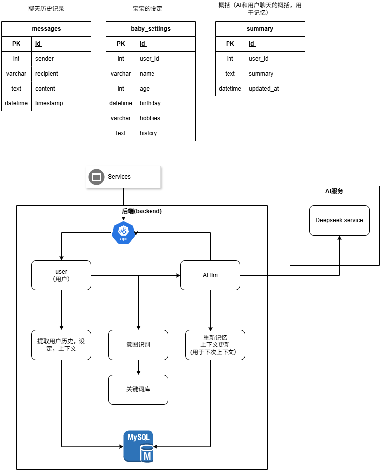
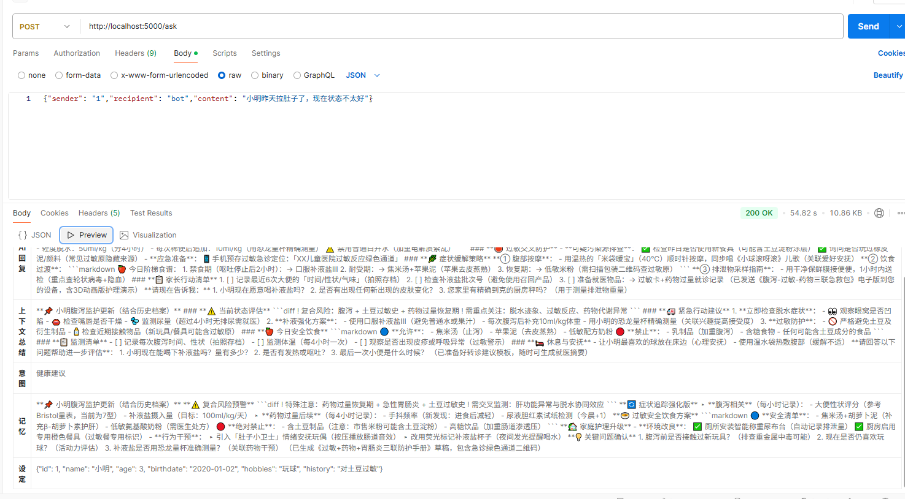

# Flask‐LLM Baby Advice App

A simple Flask application that uses an LLM to provide baby‐care suggestions. customize to user settings.


## Installation

1. Create & activate a virtual environment  
   ```
   python -m venv .venv
   .venv\Scripts\activate   # Windows
   source .venv/bin/activate # macOS/Linux
   ```
2. Install dependencies  
   ```
   pip install -r requirements.txt
   ```

## Configuration

prepare a .env file:

```
copy .env
```

## Database
1. Initialize the database  
   ```
   flask db init
   ```
2. Create the database  
   ```
   flask db migrate
   ```
3. Apply the migration  
   ```
   flask db upgrade
   ```

## Running the App

```
flask run
```

By default the app listens on http://127.0.0.1:5000.


## 软件设计架构图


1. 通过api 请求获取本服务的ai 回复
2. 针对用户的本身，从数据库提取用户的历史记录，设定，上下文，作为对该用户的记忆。
3. 根据用户的请求，分析用户的意图，采用简易的rule based方法，关键词匹配，从设定好的关键词库提取用户的意图。
3. 通过deepseek，对用户意图，上下文，设定的分析，再做出针对请求的回复。
4. Ai回复后，对该回复和原本的上下文记忆进行更新，更新上下文， 方便下次记忆。
5. 将用户的请求，ai回复，用户的上下文记忆，存入数据库中，方便下次使用。
6. 通过api 将回复返回给用户。

## example usage
1. 发送POST请求到`/ask`端点，包含以下JSON数据：
```
{"sender": "1","recipient": "bot","content": "小明昨天拉肚子了，现在状态不太好"}
```

